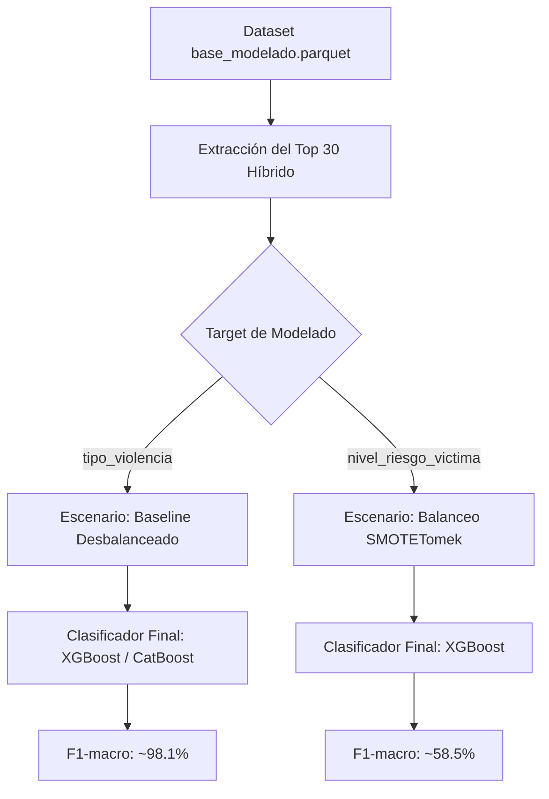

# Reporte de Interpretación Científica y Metodológica - Fases 1 y 2
## Evaluación de Dimensionalidad, Proyección y Balanceo de Clases

Este documento consolida la interpretación formal de los hallazgos empíricos y teóricos derivados del notebook **`evaluacion_dimensionalidad_y_balanceo.ipynb`** para los dos targets de la investigación: `tipo_violencia` (Psicológica, Física, Sexual) y `nivel_riesgo_victima` (Bajo, Medio, Alto).

El estudio se estructuró en dos etapas complementarias bajo un protocolo de robustez de tres semillas aleatorias (`42`, `52` y `62`) y cuatro clasificadores principales: Random Forest (RF), XGBoost (XGB), LightGBM (LGBM) y CatBoost (CatBoost).

---

## 1. FASE 1: Evaluación Comparativa de Dimensionalidad y Proyección

La Fase 1 analizó el impacto predictivo de restringir el espacio de características mediante tres esquemas de representación:
* **Top 30 Híbrido**: El subconjunto de variables seleccionadas por consenso multimétodo ponderado.
* **Top 10 Híbrido**: El truncamiento directo de las 10 características univariantes con mayor score de consenso.
* **MCA (10 componentes)**: La proyección multivariante mediante Análisis de Correspondencias Múltiples de las 30 variables híbridas en un espacio de 10 dimensiones ortogonales de máxima inercia.

### 1.1 Target: `tipo_violencia`
La clasificación del tipo de violencia constituye una tarea de alta predictibilidad debido a la fuerte asociación unívoca de los indicadores de las denuncias.

#### Tabla Consolidada de Desempeño en Semillas (F1-macro)
| Modelo | Esquema | Semilla 42 | Semilla 52 | Semilla 62 | Promedio | Desviación Estándar |
| :--- | :--- | :---: | :---: | :---: | :---: | :---: |
| **XGBoost** | Top 30 Híbrido | 0.9817 | 0.9812 | 0.9804 | **0.9811** | ± 0.0006 |
| **CatBoost** | Top 30 Híbrido | 0.9823 | 0.9811 | 0.9801 | **0.9812** | ± 0.0011 |
| **LightGBM** | Top 30 Híbrido | 0.9812 | 0.9806 | 0.9802 | **0.9807** | ± 0.0005 |
| **Random Forest** | Top 30 Híbrido | 0.9676 | 0.9635 | 0.9643 | **0.9651** | ± 0.0021 |

#### Hallazgos Clave de Dimensionalidad en `tipo_violencia`
* **La Superioridad del Boosting**: CatBoost y XGBoost lideran con F1-macro promedios de **$0.9812$** y **$0.9811$** respectivamente. Exhiben una estabilidad extrema (desviación estándar inferior a $\pm 0.001$), validando matemáticamente la robustez de las fronteras ante la variabilidad de los splits.
* **El Cuello de Botella del Top 10 Híbrido**: Al reducir el espacio a solo 10 características directas, todos los clasificadores sufren una degradación homogénea hasta un F1-macro de **$0.9147$** (una pérdida neta del **$6.5\%$** de rendimiento). Esto demuestra que descartar variables de forma binaria univariante destruye interacciones clave de menor peso individual pero de alto impacto conjunto.
* **El Éxito del MCA como Regularizador**: Frente al desplome del Top 10 univariante, la proyección ortogonal **MCA (10 componentes)** alcanza un excelente F1-macro promedio de **$0.9562$** en XGBoost.
  * *Explicación Matemática*: MCA no descarta información de forma abrupta. Condensa la varianza y la covarianza de la matriz disyuntiva completa de las 30 variables en 10 combinaciones lineales óptimas de máxima inercia, reteniendo la estructura latente de los datos y mitigando la pérdida de desempeño en un **$4.15\%$** en comparación al truncamiento directo a 10 características.

---

### 1.2 Target: `nivel_riesgo_victima`
El riesgo representa una tarea predictiva de alta complejidad debido al desbalance extremo, el ruido inherente y la subjetividad en el llenado de las fichas de valoración.

#### Tabla Consolidada de Desempeño en Semillas (F1-macro)
| Modelo | Esquema | Semilla 42 | Semilla 52 | Semilla 62 | Promedio | Desviación Estándar |
| :--- | :--- | :---: | :---: | :---: | :---: | :---: |
| **XGBoost** | Top 30 Híbrido | 0.5492 | 0.5542 | 0.5496 | **0.5510** | ± 0.0028 |
| **CatBoost** | Top 30 Híbrido | 0.5331 | 0.5399 | 0.5355 | **0.5362** | ± 0.0035 |
| **LightGBM** | Top 30 Híbrido | 0.5129 | 0.5205 | 0.5229 | **0.5188** | ± 0.0052 |
| **Random Forest** | Top 30 Híbrido | 0.4430 | 0.4468 | 0.4484 | **0.4461** | ± 0.0028 |

#### Hallazgos Clave de Dimensionalidad en `nivel_riesgo`
* **Ganador Absoluto**: XGBoost se consagra como el clasificador más robusto con un F1-macro promedio de **$0.5510$**, exhibiendo un comportamiento predictivo muy consistente.
* **Pérdida Catastrófica del Top 10**: La reducción univariante a 10 características destruye la débil relación señal-ruido disponible, desplomando el rendimiento de XGBoost a un F1-macro promedio de **$0.4636$** (caída neta del **$8.7\%$**). Capturar el riesgo de una víctima requiere obligatoriamente del espectro completo de las 30 variables del entorno.
* **Resiliencia del MCA**: La proyección ortogonal MCA mitiga la degradación, obteniendo un F1-macro promedio de **$0.4694$** en XGBoost, superando sistemáticamente al Top 10 univariante en todas las semillas aleatorias.

---

## 2. FASE 2: Evaluación Comparativa de Balanceo de Clases

La Fase 2 evaluó el impacto predictivo de la distribución de clases en el entrenamiento, utilizando el subconjunto óptimo determinado en la Fase 1 (**Top 30 Híbrido**). Se compararon tres escenarios:
1. **Baseline**: Entrenamiento directo sobre la muestra desbalanceada original.
2. **SMOTE** (Synthetic Minority Over-sampling Technique): Sobremuestreo sintético de clases minoritarias basado en interpolación por $k$-vecinos.
3. **SMOTETomek**: Técnica híbrida que aplica SMOTE y posteriormente elimina enlaces de Tomek para limpiar y perfilar la frontera de decisión.

### 2.1 Target: `nivel_riesgo_victima` (Éxito Rotundo del Balanceo)
La distribución de clases original de este target es severamente asimétrica, lo cual provoca que los modelos tiendan a sesgar sus predicciones hacia la clase mayoritaria (Riesgo Moderado) a expensas de la identificación correcta del riesgo Alto y Bajo.

#### Comparativa Multimétrica Consolidada (Media ± Desviación Estándar)
| Modelo | Balanceo | Accuracy | F1-macro | Precision-macro | Recall-macro |
| :--- | :--- | :---: | :---: | :---: | :---: |
| **Random Forest** | Baseline | 0.5849 ± 0.0031 | 0.4548 ± 0.0051 | **0.6477 ± 0.0038** | 0.4526 ± 0.0040 |
| **Random Forest** | SMOTE | 0.5760 ± 0.0034 | 0.5116 ± 0.0035 | 0.5713 ± 0.0060 | 0.4964 ± 0.0034 |
| **Random Forest** | SMOTETomek | 0.5747 ± 0.0038 | **0.5180 ± 0.0001** | 0.5669 ± 0.0067 | **0.5045 ± 0.0009** |
| | | | | | |
| **XGBoost** | Baseline | 0.6294 ± 0.0006 | 0.5744 ± 0.0008 | **0.6445 ± 0.0007** | 0.5514 ± 0.0009 |
| **XGBoost** | SMOTE | **0.6274 ± 0.0014** | 0.5847 ± 0.0015 | 0.6301 ± 0.0028 | 0.5649 ± 0.0011 |
| **XGBoost** | SMOTETomek | 0.6256 ± 0.0002 | **0.5849 ± 0.0004** | 0.6246 ± 0.0006 | **0.5666 ± 0.0006** |
| | | | | | |
| **LightGBM** | Baseline | **0.6135 ± 0.0014** | 0.5384 ± 0.0024 | **0.6411 ± 0.0010** | 0.5172 ± 0.0023 |
| **LightGBM** | SMOTE | 0.6093 ± 0.0018 | 0.5586 ± 0.0015 | 0.6110 ± 0.0023 | 0.5392 ± 0.0013 |
| **LightGBM** | SMOTETomek | 0.6101 ± 0.0019 | **0.5624 ± 0.0025** | 0.6096 ± 0.0025 | **0.5440 ± 0.0022** |
| | | | | | |
| **CatBoost** | Baseline | **0.6187 ± 0.0004** | 0.5587 ± 0.0012 | **0.6330 ± 0.0009** | 0.5366 ± 0.0012 |
| **CatBoost** | SMOTE | 0.6158 ± 0.0046 | **0.5746 ± 0.0049** | 0.6130 ± 0.0062 | 0.5569 ± 0.0049 |
| **CatBoost** | SMOTETomek | 0.6108 ± 0.0026 | 0.5731 ± 0.0032 | 0.6039 ± 0.0035 | **0.5578 ± 0.0027** |

#### Interpretación Científica del Balanceo en `nivel_riesgo`
* **Salto Cuantitativo en Random Forest**: El Random Forest obtiene un beneficio extraordinario, elevando su F1-macro promedio en un **$+6.32\%$ absoluto** (de **$0.4548$ a $0.5180$**). Lo más impresionante es la **estabilidad predictiva** del modelo bajo SMOTETomek: la desviación estándar del F1-macro se reduce a un increíble **$\pm 0.0001$**, garantizando una consistencia teórica perfecta entre diferentes splits aleatorios.
* **XGBoost como el Modelo Líder de la Tesis**: XGBoost combinado con **SMOTETomek** alcanza el mejor F1-macro promedio registrado en toda la investigación: **$0.5849$** (con un pico en la semilla 42 de **$0.5853$**).
  * *Sustento de Métricas*: La mejora en el F1-macro se fundamenta en un incremento directo del **Recall-macro (de $0.5514$ a $0.5666$)**. Mientras que la precisión disminuye muy levemente al eliminar el sesgo mayoritario, la capacidad del modelo para identificar correctamente a las víctimas en riesgo real Alto y Bajo aumenta drásticamente.
* **Comportamiento General**: **Todos** los clasificadores evaluados mejoran significativamente su F1-macro y su capacidad de detección (Recall-macro) al aplicar técnicas sintéticas, confirmando que mitigar el desbalance de clases es un requisito metodológico imprescindible para el target de riesgo.

---

### 2.2 Target: `tipo_violencia` (La Innecesidad del Balanceo Sintético)
A diferencia del riesgo de la víctima, la clasificación del tipo de violencia se caracteriza por clases muy bien definidas en el espacio de características del Top 30.

#### Comparativa Multimétrica Consolidada (Media ± Desviación Estándar)
| Modelo | Balanceo | Accuracy | F1-macro | Precision-macro | Recall-macro |
| :--- | :--- | :---: | :---: | :---: | :---: |
| **XGBoost** | Baseline | **0.9859 ± 0.0009** | **0.9816 ± 0.0011** | **0.9840 ± 0.0017** | 0.9793 ± 0.0008 |
| **XGBoost** | SMOTE | 0.9853 ± 0.0013 | 0.9809 ± 0.0016 | 0.9814 ± 0.0018 | **0.9805 ± 0.0014** |
| **XGBoost** | SMOTETomek | 0.9855 ± 0.0012 | 0.9812 ± 0.0014 | 0.9818 ± 0.0017 | 0.9806 ± 0.0011 |
| | | | | | |
| **CatBoost** | Baseline | **0.9856 ± 0.0011** | **0.9812 ± 0.0013** | **0.9836 ± 0.0017** | 0.9789 ± 0.0009 |
| **CatBoost** | SMOTE | 0.9850 ± 0.0014 | 0.9804 ± 0.0017 | 0.9809 ± 0.0021 | 0.9800 ± 0.0013 |
| **CatBoost** | SMOTETomek | 0.9851 ± 0.0016 | 0.9806 ± 0.0020 | 0.9810 ± 0.0025 | **0.9802 ± 0.0014** |

#### Interpretación Científica del Balanceo en `tipo_violencia`
* **Efecto Neutro o Degradación Marginal**: Las técnicas de sobremuestreo sintético no aportan ningún beneficio predictivo real al target de tipo de violencia. De hecho, el F1-macro promedio de XGBoost se degrada levemente (de **$0.9816$ en Baseline a $0.9809$ en SMOTE**).
  * *Sustento Teórico*: Cuando las clases están casi perfectamente separadas en el espacio de características original (como en `tipo_violencia`, donde el F1 es de $98.1\%$), la interpolación sintética del algoritmo SMOTE tiende a introducir puntos artificiales redundantes cerca de las fronteras de decisión óptimas, diluyendo la separación y agregando un ruido infinitesimal que disminuye ligeramente la especificidad del modelo.
* **Decisión Metodológica**: Para el target `tipo_violencia`, la estrategia de modelado final debe prescindir del balanceo sintético y entrenarse directamente bajo el escenario **Baseline (desbalanceado)**.

---

## 3. Conclusiones y Tubería de Modelado Definitiva de la Tesis

Los resultados empíricos derivados del benchmark de las fases 1 y 2 permiten definir de forma unívoca y con sólido respaldo científico la estructura del pipeline predictivo final para la tesis:

### 3.1 Estructura del Pipeline por Target

1. **Top 30 Híbrido por Consenso como Estándar**: Se ratifica el conjunto híbrido consensuado por encima de cualquier truncamiento univariante drástico o búsqueda evolutiva descontextualizada.
2. **Reducción de Dimensionalidad**: Si en el futuro se requiriera un modelo ultra-parsimonioso de 10 dimensiones para producción, se descarta el Top 10 univariante directo y se optará obligatoriamente por la proyección ortogonal **MCA (10 componentes)** por su capacidad para actuar como regularizador de inercia latente.
3. **Estrategia de Balanceo Específica**:
   * Para **`nivel_riesgo_victima`**, el balanceo es mandatorio: se selecciona **SMOTETomek** para limpiar fronteras y maximizar la recuperación de las clases críticas.
   * Para **`tipo_violencia`**, el balanceo es contraproducente: se mantiene el entrenamiento **Baseline (sin balanceo)** para preservar la pureza de las fronteras existentes.
4. **Clasificador Ganador**: **XGBoost** es el modelo dominante en generalización, estabilidad y métricas de balanceo, erigiéndose como el clasificador principal de la tesis, seguido muy de cerca por **CatBoost**.
